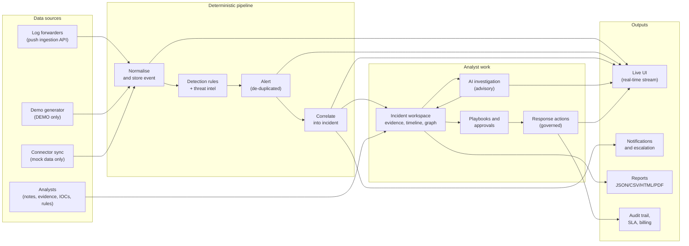
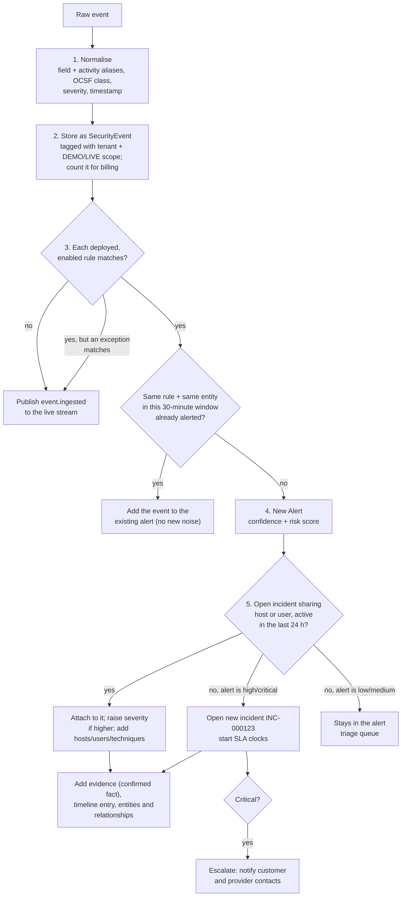
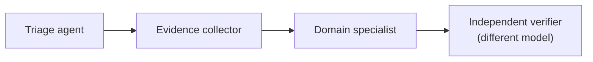

# ASTRASOC Platform Guide

This guide explains the whole platform in one place:

1. [What ASTRASOC is](#1-what-astrasoc-is)
2. [The big picture](#2-the-big-picture)
3. [Where the data comes from](#3-where-the-data-comes-from)
4. [What happens to every event](#4-what-happens-to-every-event)
5. [A worked example, start to finish](#5-a-worked-example-start-to-finish)
6. [Investigation and AI](#6-investigation-and-ai)
7. [Detection engineering and threat hunting](#7-detection-engineering-and-threat-hunting)
8. [Automation and response](#8-automation-and-response)
9. [What comes out of the platform](#9-what-comes-out-of-the-platform)
10. [Managed service (MSSP) features](#10-managed-service-mssp-features)
11. [Security and governance](#11-security-and-governance)
12. [DEMO mode and LIVE mode](#12-demo-mode-and-live-mode)
13. [Every page in the console](#13-every-page-in-the-console)
14. [How to connect your real data](#14-how-to-connect-your-real-data)
15. [What it does not do yet](#15-what-it-does-not-do-yet)
16. [Glossary](#16-glossary)

Each statement below was checked against the code in this repository. Where
a feature is only partly built, the guide says so. The labels mean:

- ✅ **Works:** implemented and tested.
- 🟡 **Partial:** works with limits, which are described.
- ⛔ **Not built:** the screen or setting exists, but the real behaviour
  does not yet.

---

## 1. What ASTRASOC is

ASTRASOC is a **security operations platform** (a SOC platform). It receives
security events (process starts, sign-ins, network connections and so on),
finds the suspicious ones with detection rules, groups them into incidents,
helps analysts investigate with AI assistants, and records every decision
in a tamper-evident audit log.

It is built for a **managed security service provider (MSSP)**. One
installation serves:

- the provider's own SOC team,
- optional **resellers** (partners who manage their own customers), and
- many **customer organisations**, each completely isolated from the others.

Two principles run through everything:

1. **Detection and control are deterministic.** Rules, permissions, tenant
   isolation, approvals and audit are ordinary code enforced by the API.
   They never depend on an AI model.
2. **AI is advisory.** AI output is always labelled as an *inference*. It
   can suggest, but it cannot grant access, mark something as a confirmed
   fact, or execute an action.

---

## 2. The big picture



In words:

1. Events arrive, mainly through the **push ingestion API**.
2. Each event is cleaned up (normalised) and stored.
3. Every enabled detection rule checks the event. A match raises an
   **alert**.
4. Alerts that belong together (same host or user, within 24 hours) are
   joined into one **incident**. High and critical alerts open a new
   incident if none exists yet.
5. Analysts work the incident: they read the evidence and timeline, run AI
   investigations, add notes and decide on actions.
6. Actions go through playbooks, policy and approvals before anything
   touches a real system.
7. Everything is streamed live to the browser, measured against SLAs,
   counted for billing and written to the audit log.

---

## 3. Where the data comes from

| # | Source | How it enters | Status | Scope |
|---|--------|---------------|--------|-------|
| 1 | **Log forwarders, SIEM exports, scripts** | `POST /api/v1/ingest/events` with an API key | ✅ Works. **This is the way real data enters today.** | LIVE or DEMO, whichever the tenant is in |
| 2 | **Demo event generator** | Background worker creates realistic simulated events every ~3 s | ✅ Works | DEMO only |
| 3 | **Seeded attack scenarios** | 15 built-in stories (ransomware, identity compromise, phishing…) loaded at startup | ✅ Works | DEMO only |
| 4 | **Connector "Sync" button** | Pulls events from the connector's adapter | 🟡 Mock connectors return simulated events. Real vendor pull adapters are **not built**: they return no events. | DEMO only for mock data (refused in LIVE) |
| 5 | **Analysts** | Notes, evidence, attested facts, threat indicators, knowledge documents, detection rules | ✅ Works | The tenant's current scope |
| 6 | **Threat indicators (IOCs)** | Added one by one through the Threat Intelligence page or `POST /api/v1/threat-intel` | ✅ Works. Automatic feed import (MISP, TAXII) is **not built**. | Per tenant |
| 7 | **LLM providers** | Answers to AI investigation prompts | ✅ Works with a configured provider; the built-in simulated reasoner is always available | Per tenant policy |

### 3.1 The push ingestion API (the main live source)

**Who can send:** anyone holding an API key with the `event:ingest` scope.
Create one in *My Account → API keys* with the "Log forwarder" preset. The
key belongs to one tenant and can only write into that tenant.

**Request:**

```http
POST /api/v1/ingest/events
X-API-Key: ask_...
Content-Type: application/json

{
  "events": [
    {
      "source": "sysmon",
      "event_time": "2026-09-29T10:15:00Z",
      "activity": "process_creation",
      "host": "FIN-WS-042",
      "user": "corp\\jdoe",
      "CommandLine": "powershell.exe -enc SQBFAFgA...",
      "severity": "medium"
    }
  ]
}
```

**Limits:** at most 500 events per request and a 5 MiB body. Requests are
rate-limited per API key.

**Fields the platform understands.** Only `activity` really matters; the
rest is optional. Unknown fields are kept and can still be matched by rules
and searched.

| Meaning | Accepted field names |
|---------|---------------------|
| What happened | `activity`, `action`, `event_type` |
| When | `event_time`, `ts`, `time` (ISO 8601; defaults to "now") |
| Host | `host`, `host_name` |
| User | `user`, `user_name` |
| Source / destination IP | `src_ip`, `dst_ip` |
| Severity | `severity` (`info`, `low`, `medium`, `high`, `critical`) |
| Product | `source` |
| Command line | `cmdline`, `command_line`, `CommandLine`, `process.command_line` |
| Process | `process_name`, `Image`, `process.name`; parent: `parent_process`, `ParentImage` |
| Target process | `target_process`, `TargetImage` |
| DNS name | `query`, `QueryName`, `dns.question.name` |
| Group | `group`, `group_name`, `TargetUserName` |

**Activity names are translated automatically.** Sysmon, Windows Security,
ECS and common EDR spellings map onto the names the rules use:

| Canonical activity | Also accepted |
|--------------------|---------------|
| `Process create` | `process_creation`, `process_start`, `sysmon:1`, `4688` |
| `Process access` | `process_access`, `sysmon:10` |
| `Network connection` | `network_connection`, `connection`, `sysmon:3` |
| `DNS query` | `dns`, `dns_query`, `sysmon:22` |
| `Sign-in` | `login`, `logon`, `authentication`, `4624` |
| `File write` | `file_create`, `sysmon:11` |
| `Group membership change` | `4728`, `4732`, `4756` |

Each event is also given an **OCSF class** (for example 1007 "Process
Activity", 3002 "Authentication") so it lines up with the open
cybersecurity schema.

### 3.2 Connectors (28 definitions)

Connectors describe the external products the platform can talk to. Each
has a setup form, a secret reference (never the secret itself), a real
**Test connection**, health history, separate read and write permissions,
a rate limit, and a circuit breaker that stops calling a failing product.

| Category | Connectors | Test connection | Pull events | Live write |
|----------|-----------|:---:|:---:|:---:|
| SIEM | CrowdStrike LogScale, Splunk, Microsoft Sentinel, Elastic/OpenSearch, Generic REST SIEM, Generic Syslog | ✅ | ⛔ | Generic REST SIEM ✅ |
| EDR / NDR | CrowdStrike Falcon, Microsoft Defender, Vectra, Stellar Cyber, Generic EDR/NDR | ✅ | ⛔ | Generic EDR ✅; Falcon and Defender ⛔ |
| Identity | Microsoft Entra ID, Active Directory, Keycloak, Generic LDAP | ✅ | ⛔ | ⛔ |
| Threat intel | MISP, VirusTotal, TAXII, Generic STIX/TAXII | ✅ | ⛔ | read-only |
| ITSM | ServiceNow, Jira | ✅ | ⛔ | ✅ (ticket creation) |
| Messaging | Slack, Microsoft Teams, Email webhook | ✅ | ⛔ | ✅ (messages, escalation) |
| Cloud | AWS, Azure, Google Cloud, Kubernetes audit logs | ✅ | ⛔ | read-only |

What the columns mean:

- **Test connection** makes a real HTTP call to the product with the
  configured credential and reports what actually happened: `healthy`,
  `degraded`, `unhealthy` (for example, credential rejected), or
  `not_configured` (no URL or secret). Mock connectors report
  `healthy (mock)`. A healthy state is never invented.
- **Pull events ⛔:** the vendor-specific query code is not written yet,
  so a real connector's Sync returns zero events and says so. Send that
  product's data through the push ingestion API instead (most SIEMs and
  forwarders can POST JSON).
- **Live write** is used by response actions and notifications. For the
  ✅ kinds, one HTTP POST really is the action (post a message, open a
  ticket, call a webhook), and the true HTTP result is recorded. Endpoint
  control (isolate a host in Falcon or Defender, disable an Entra
  account) needs vendor-specific multi-step APIs. Those raise "not
  implemented" instead of pretending.

Every outbound call passes an **egress policy**: cloud metadata addresses
are blocked, loopback is blocked by default, the DNS lookup is repeated at
request time, redirects are not followed, and an optional host allowlist
applies.

---

## 4. What happens to every event

Events from every source take the same path (`services/pipeline.py`):



### Step 1: Normalise
Vendor spellings become canonical names (section 3.1). The timestamp is
parsed, and the severity is checked against the five allowed values. Fields
the platform doesn't know are kept in the event's OCSF payload.

### Step 2: Store and meter
The event is saved with its **tenant** and its **scope** (DEMO or LIVE).
DEMO and LIVE data never mix. The tenant's "events ingested" counter goes up
for usage billing.

### Step 3: Detect
Every rule that is **deployed and enabled** for that tenant runs against the
event. Rules are small, readable conditions, not code and not AI:

```json
{"all": [
  {"field": "activity", "op": "eq",       "value": "Process create"},
  {"field": "cmdline",  "op": "contains", "value": "delete shadows"}
]}
```

Available operators: `eq`, `ne`, `contains`, `regex`, `in`, `gte`, `lte`,
`exists`, and `threat_intel`. The last one matches when the field's value
(an IP or domain) is one of the tenant's enabled threat indicators.
Conditions combine with `all` (AND) or `any` (OR).

**Exceptions** suppress known-benign matches per rule, for example
"ignore this rule when `host` is `BACKUP-01`".

The platform ships **7 starter rules**:

| Rule | Severity | MITRE ATT&CK |
|------|----------|--------------|
| Shadow copy deletion (ransomware precursor) | critical | T1490 |
| LSASS memory access (credential dumping) | critical | T1003.001 |
| Encoded PowerShell command | high | T1059.001 |
| Outbound connection to threat-intel IP | high | T1071 |
| DNS lookup of threat-intel domain | high | T1071.004 |
| Sign-in from threat-intel IP | high | T1078 |
| Privileged group membership change | high | T1098 |

You add your own on the Detection Engineering page (section 7).

### Step 4: Alert (with de-duplication)
A match creates an **alert**. If the same rule already fired for the same
host, user or IP in the same 30-minute window, the event is added to that
alert instead of creating a new one. The alert gets:

- **Confidence** from the rule's severity: critical 0.85, high 0.75,
  medium 0.6, low 0.45, info 0.3.
- **Risk score** = 20 × severity rank × confidence + 10, where the severity
  rank runs from info = 0 to critical = 4. A critical alert scores 78.
- **Observables** (host, user, source and destination IP) and the rule's
  ATT&CK techniques.

### Step 5: Correlate into an incident
The platform looks for an **open incident** in the same tenant and scope
that involves the **same host or user** and was active in the **last 24
hours**.

- **Found:** the alert joins it. The incident's severity rises if this
  alert is worse, and the new hosts, users and techniques are added.
- **Not found, and the alert is high or critical:** a new incident opens
  (`INC-000001`, `INC-000002`, …) and the customer's SLA clocks start.
- **Not found, and the alert is low or medium:** it waits in the alert
  queue for an analyst to triage.

The incident then receives:

- the triggering event as **confirmed-fact evidence**, citing the event id
  as its source,
- a **timeline** entry,
- **entities** (host, user, IP) and **relationships** between them
  (user *logged_into* host, host *connected_to* IP) for the entity graph.

A new **critical** incident is escalated immediately to the customer's and
the provider's contacts.

### Step 6: Live updates
Each stage publishes an event to the live stream (`event.ingested`,
`alert.created`, `incident.created`, `incident.updated`, and later
`agent.finished`, `action.executed` and others). Open browsers update
without a page reload. With several API servers, the events are shared
through PostgreSQL, so every analyst sees everything, whichever server they
are connected to.

---

## 5. A worked example, start to finish

1. A customer's log forwarder sends a Sysmon event: `process_creation` on
   host `FIN-WS-042`, user `corp\jdoe`, command line
   `powershell.exe -enc SQBFAFgA...`.
2. **Normalise:** `process_creation` becomes `Process create`, and
   `CommandLine` is copied to `cmdline`. The OCSF class is 1007 (Process
   Activity).
3. **Detect:** the rule *Encoded PowerShell command* matches (activity =
   Process create, and `cmdline` matches the `-enc` pattern).
4. **Alert:** "Encoded PowerShell command on FIN-WS-042": severity high,
   confidence 0.75, risk score 55, technique T1059.001.
5. **Correlate:** no open incident mentions FIN-WS-042 or jdoe, and the
   alert is high, so **INC-000042** opens. Under an Enterprise contract the
   acknowledgement clock is 60 minutes and the resolution clock 12 hours.
6. **Evidence:** the event becomes confirmed-fact evidence. The timeline
   shows the process start. The graph shows jdoe → FIN-WS-042.
7. **Live:** the analyst's dashboard, the unified queue and the wallboard
   show the new incident within about a second.
8. Ten minutes later the same host looks up a domain that is on the
   tenant's threat-intel list. *DNS lookup of threat-intel domain* fires,
   and the alert **joins INC-000042** because the host is the same.
9. The analyst **acknowledges** the incident, which stops the
   acknowledgement clock, and runs **Investigate**. The AI agents add
   hypotheses such as "likely malicious PowerShell stager", labelled
   *model inference*, with their confidence and the evidence they cite.
10. The analyst proposes **Isolate endpoint**. Policy requires approval
    because the host is a critical asset. An incident commander approves.
    The action is dry-run, executed, verified and audited (section 8).
11. The analyst resolves the incident, which stops the resolution clock,
    and generates an **incident report** as PDF. The month's **SLA
    compliance** and **usage** reports include this incident.

---

## 6. Investigation and AI

### 6.1 How an investigation runs
An analyst (or an API call) presses **Investigate** on an incident. The
**coordinator** runs four bounded agents in a fixed order:



The **specialist** is chosen from the incident's ATT&CK techniques:

| Techniques present | Specialist |
|-------------------|------------|
| T1078, T1110, T1621, T1098 | Identity investigator |
| T1071, T1090, T1573, T1048 | Network investigator |
| T1566, T1204 | Email investigator |
| T1552, T1078.004, T1580, or a cloud tactic | Cloud investigator |
| anything else | Endpoint investigator |

Agents don't talk to each other freely. The coordinator passes a case
snapshot along the chain.

### 6.2 The 16 agents
Incident Coordinator, Triage, Evidence Collection, Endpoint, Identity,
Network, Cloud, Email, Threat-Intelligence, Malware-Analysis, Attack-Path,
Detection-Engineering (drafts Sigma rules; never deploys them),
Response-Planning (proposes actions; never executes them), Independent
Verification, Incident-Reporting, and Lessons-Learned. Any single agent can
also be run on its own from the Agent Command Center.

Every agent has hard limits: a time limit, a token budget, a maximum
number of tool calls, and an **allowlist** of the tools it may use.

### 6.3 What the agents can read (tools)

| Tool | Reads from | Status |
|------|-----------|--------|
| Get incident, list alerts, get alert, list evidence, get timeline | The platform's own incident data | ✅ |
| Search events | Stored security events | ✅ |
| Get entity, get entity graph, get user context | The entity graph | ✅ |
| Lookup IOC | The tenant's threat indicators | ✅ |
| List sign-ins, endpoint detail, list processes, cloud activity, email detail, search threat intel, file reputation, resolve domain | Would query the external product | ⛔ Returns a placeholder marked `"status": "simulated"` in every mode. The vendor queries are not built. |

All tools are **read-only** and limited to the caller's tenant and scope.
Response tools (isolate, block, disable…) are not available to agents at
all.

### 6.4 The model gateway (how an AI model is chosen and called)
Before any real model is called, the gateway checks the tenant's AI policy:

1. Is AI switched on for this tenant?
2. Its **LLM strategy**: `simulated`, `private`, `hosted`, `hybrid` or
   `disabled`.
3. **Private models only** setting.
4. Does the plan include external LLMs (the `external_llm` entitlement)?
5. **Data residency:** the model must be in an allowed region.
6. **Data classification:** in `hybrid`, confidential and restricted cases
   stay on private models.
7. **Budgets:** the provider's daily and the tenant's monthly token limits.

Then the case text is:

- **DLP-scrubbed** (secrets and credentials masked),
- **screened for prompt injection**,
- wrapped in an explicit `<untrusted_external_content>` boundary, so
  attacker-controlled log text is treated as data,
- **trimmed structurally** to the prompt budget, so the model always
  receives valid JSON.

After the answer comes back, every evidence id the model cites is
**checked against the real case**, and invented citations are dropped.

**Supported providers:** Anthropic (Messages API), OpenAI, Azure OpenAI,
vLLM, Ollama, and any OpenAI-compatible endpoint. Gemini works through its
OpenAI-compatible endpoint. Bedrock has no native signed client; use it
through an OpenAI-compatible gateway. A built-in **simulated reasoner**
always works without any external model, so the platform is fully usable
with AI off or no API key.

### 6.5 What happens to AI output
- The conclusion is stored as a **hypothesis** with its confidence,
  supporting evidence and "missing evidence" list, plus a
  **model-inference** evidence item.
- It is **never** stored as a confirmed fact. Only an analyst can promote a
  hypothesis, and only a person with `evidence:attest` plus a source
  reference can create a confirmed fact.
- Every run is recorded (model used, provider, tokens, tool calls, step
  trace) and counted for billing ("agent runs", "LLM tokens").

### 6.6 Evidence types
Evidence is always labelled with where it came from:

| Type | Meaning | Who creates it |
|------|---------|----------------|
| `confirmed_fact` | Proven by telemetry or an attested source | The pipeline, or a person attesting with a source |
| `model_inference` | What an AI agent concluded | Agents |
| `analyst_conclusion` | An analyst's judgement | Analysts |
| `assumption` | Believed but not verified | Analysts |
| `missing_evidence` | What would be needed to confirm | Agents or analysts |
| `recommended_action` | A proposed response | Agents or analysts |
| `executed_action` | A response that was carried out | The response gateway |

### 6.7 Controlled learning
Analysts mark AI output **correct**, **incorrect** or **partially correct**.
Reviewed feedback builds **evaluation datasets**. **Evaluation runs** score
agents against them, and a better version can be **promoted** explicitly.
Nothing retrains or changes automatically.

### 6.8 Knowledge base
Tenants can store text documents (runbooks, asset notes) with a data
classification, and search them with a keyword retriever that respects
tenant and classification. 🟡 The agents do **not** consult the knowledge
base yet; it is an analyst search tool today.

---

## 7. Detection engineering and threat hunting

**Rule lifecycle:** draft → review → approved → deployed (or disabled).

- **Four-eyes:** a rule must be approved by someone other than its author.
- **Replay:** test a rule against stored events before deploying it. The
  result shows matches and, if events are labelled, **precision and
  recall**.
- **Versioning:** every change to a rule's logic raises its version and is
  recorded in the rule's history with who changed it.
- **Sigma:** rules keep a Sigma description. A best-effort translator turns
  simple Sigma selections into Splunk SPL, Sentinel KQL, LogScale or
  Elastic query text so you can reuse them in your SIEM. It is not a full
  Sigma compiler and says so when it cannot translate something.
- **Managed content (MSSP):** the provider publishes approved rules to
  customers as managed, versioned copies. A customer's own exceptions
  survive redeploys. Customer-owned rules are never overwritten.

**Query Workbench (threat hunting):** 🟡 type a search in the style of
Splunk SPL, Sentinel KQL, CrowdStrike LogScale, Elastic, SQL or Sigma. The
engine extracts `field = value`, `field !=
value` and `field contains value` conditions, maps vendor field names (for
example `ComputerName`, `UserPrincipalName`, `DestinationIp`) onto the
stored events, and runs them safely: read-only, limited to the tenant and
scope, row-capped. Anything it could not apply is listed under
**unsupported terms**, so you know exactly what was not filtered. It is
**not** a full SPL or KQL engine: no aggregations, joins or pipes.
Destructive statements are refused. This feature needs the
`threat_hunting` entitlement.

**Threat intelligence:** IOCs (IP, domain, hash, URL, email) with severity,
confidence, TLP, source, tags and expiry. Enabled IOCs are matched live by
`threat_intel` rules, and agents can look them up.

---

## 8. Automation and response

### 8.1 Playbooks (durable workflows)
A playbook is a list of steps. The engine saves its state after **every
step**, so a run survives restarts and can wait days for an approval
without redoing finished steps.

**Step types:** trigger, condition, enrichment, query, agent task,
approval, delay, branch, parallel, response action, verification,
rollback, notification, case update, report.

- **Condition** steps check the incident (for example confidence ≥ 0.7,
  severity in high/critical). If false, the run ends as
  "condition not met".
- **Approval** steps pause the run until someone with `approval:decide`
  **and** the required role (for example incident commander) decides.
- **Response action** steps never act directly. They create a response
  action that goes through the governed path below.
- A failing step **stops** the run unless the step says
  `"on_failure": "continue"`. A failed run is never shown as completed.

**Built-in playbooks (4):** Ransomware Precursor (contain and verify),
Identity Compromise (revoke and monitor), Phishing Triage, Generic
Enrichment.

🟡 Playbooks start **when a person or API call runs them**
(`POST /api/v1/playbooks/{key}/run`). A playbook's trigger definition (for
example "on incident.created") is stored, but nothing starts playbooks
automatically yet.

### 8.2 Response actions
Available action types: isolate/release endpoint, disable account, revoke
sessions, block IP, block domain, quarantine email, create ticket, collect
endpoint evidence, plus monitoring and notification actions.

Every action goes through a fixed sequence:

```
schema check → evidence check → confidence → asset criticality → blast radius
→ RBAC → policy → approval (if required) → dry-run → execute → verify
→ rollback (if needed) → audit
```

The **policy** (policy-as-code, editable) ships with these rules:

| Rule | Effect |
|------|--------|
| Confidence below 0.5 | **Deny** |
| No supporting evidence | **Deny** |
| Target asset is high/critical | Needs approval by an incident commander |
| Action is irreversible | Needs approval by a SOC manager |
| Affects more than 5 assets | Needs approval by an incident commander |
| Monitoring, ticket or notification actions with confidence ≥ 0.7 | Allowed |
| Reversible action, confidence ≥ 0.9, asset low/medium | Allowed |

In **DEMO** mode actions are simulated and labelled as such. In **LIVE**
mode they run through the connector's write adapter. Only message, ticket
and webhook connectors can really execute today (section 3.2).

> ⚠️ **Read before enabling automated response on live customers.** This
> part was not re-reviewed during the MSSP hardening work. Two known gaps:
> a customer's "customer approval required" setting is not enforced for
> response actions, and response actions are not counted in usage/billing.
> See [KNOWN_LIMITATIONS.md](KNOWN_LIMITATIONS.md). Get an independent
> review, or restrict the `action:execute` permission, before relying on it.

---

## 9. What comes out of the platform

| Output | What it contains |
|--------|------------------|
| **Live console** | Dashboards, queues and incident pages update in real time over a secure event stream (short-lived tickets, no tokens in URLs). |
| **Wallboard** | Full-screen SOC display for a TV. |
| **Notifications** | In-app always. Escalations (SLA breach, new critical incident) also go to escalation contacts through the tenant's (or its provider's) Slack, Teams or email-webhook connector. Each delivery records its real outcome: `sent`, `failed`, `not_configured` (no real connector) or `simulated` (DEMO). |
| **Reports (13 types)** | Incident, executive summary, technical investigation, root cause, response action, timeline, ATT&CK coverage, LLM usage, automation performance, integration health, analyst performance, compliance audit, and monthly **service report** for MSSP customers. Export as JSON, CSV, HTML or PDF. |
| **Audit trail** | Every sign-in, change, decision, AI run, action and delegated access. Each entry is signed with a key kept outside the database and chained to the previous one, so editing, deleting or inserting entries is detectable. `GET /api/v1/audit/verify` checks the whole chain. |
| **SLA compliance** | Per customer and month: clocks met or missed, MTTA/MTTR, open breaches. |
| **Usage and billing** | Per customer and month: events ingested, alerts, incidents, agent runs, LLM tokens and reports; CSV export. |
| **Platform health** | API, database, event stream, demo generator, connectors and model providers, plus which server is the current leader. |
| **Data export** | A customer's full data (without credentials or password hashes) for offboarding. |

---

## 10. Managed service (MSSP) features

Full details: [MSSP.md](MSSP.md). In short:

- **Tenant hierarchy:** provider → resellers → customers, each with status
  (onboarding, active, suspended, offboarding), service tier, data region,
  contract dates, escalation contacts and report branding.
- **Delegated access:** provider staff enter a customer through the tenant
  switcher, in one of four ways:
  - provider-wide, for SOC managers,
  - a time-boxed, justified **grant** to an individual analyst,
  - platform administrators,
  - audited **break-glass**, when the customer has switched provider
    access off.

  Access is re-checked on **every request**. Every action lands in the
  **customer's** audit trail with the real analyst's name.
- **Service tiers and entitlements** (enforced by the API):

  | Feature | Essentials | Professional | Enterprise |
  |---------|:---:|:---:|:---:|
  | Monitoring and triage, reports, threat-intel enrichment | ✓ | ✓ | ✓ |
  | AI investigation, threat hunting, automated response | | ✓ | ✓ |
  | Customer-specific detections, external/private LLMs | | | ✓ |

  A contract can force any feature on or off per customer.
- **SLA engine:** acknowledgement and resolution clocks per severity; a
  checker runs every 60 seconds, marks breaches, raises the escalation
  level and notifies the customer and the provider chain.
- **Console pages:** portfolio, unified cross-customer queue, SLA
  compliance, customers (onboard, edit contract, suspend, export,
  offboard), delegated access, content distribution, shift handover, and
  usage and billing.
- **Customer self-service:** customer admins manage their own users,
  roles, contacts, branding, API keys, MFA requirement and whether the
  provider may access them.

---

## 11. Security and governance

Full details: [SECURITY.md](SECURITY.md) and [RBAC.md](RBAC.md). In short:

- **Sign-in:**
  - passwords with a strength policy and lockout after 5 failures,
  - TOTP two-step verification with recovery codes,
  - organisations can **require MFA**, and the requirement also binds
    provider staff who enter that customer.
- **Sessions:** HttpOnly cookies that page JavaScript cannot read,
  SameSite=Strict, CSRF protection, server-side revocation, and rotating
  refresh tokens with theft detection.
- **Permissions:** 56 permissions and 21 built-in roles, all checked by the
  API. Nobody can grant a permission they don't hold.
- **Isolation:** every row carries its tenant and every query filters by
  it. DEMO and LIVE data are kept apart.
- **Secrets:** only references are stored (`vault://tenants/<slug>/…`,
  with HashiCorp Vault support), confined to the tenant's own namespace.
  No secret is ever stored in the database or sent to the browser.
- **API keys:** explicit scopes, an expiry date, bound to one tenant, and
  shown only once.
- **Deployment:**
  - refuses to start in production with weak configuration,
  - runs as several API servers for high availability (PostgreSQL
    coordinates them),
  - hardened containers,
  - Helm chart and Kubernetes manifests.

---

## 12. DEMO mode and LIVE mode

Each tenant has its own operating mode.

| | DEMO | LIVE |
|---|------|------|
| Data | Simulated scenarios and a continuous generator, labelled "simulated" | Only what you send in (ingestion API) and what analysts create |
| Mock connectors | Allowed | Refused (simulated data can never enter LIVE) |
| Response actions | Simulated | Real connector writes, where supported |
| Notifications | Recorded as `simulated` | Really sent through a comms connector |
| Reset | "Reset demo data" deletes DEMO data only | LIVE data is never touched by a demo reset |

**Before switching a tenant to LIVE**, the Settings page runs readiness
checks against the real configuration:

- **Required:** at least one enabled, **non-mock** connector.
- **Required:** the deployment allows LIVE mode.
- **Advisory:** PostgreSQL rather than SQLite.
- **Advisory:** a real LLM provider is configured, or AI is deliberately
  switched off or simulated.

---

## 13. Every page in the console

**Managed Service (provider staff)**

| Page | Purpose |
|------|---------|
| Portfolio | All customers, worst first: open incidents, SLA status, approvals, connector health, contract expiry |
| Unified Queue | Open incidents across all customers, ordered by SLA urgency |
| SLA Compliance | Contract performance per customer and month |
| Customers | Onboard, edit contracts, suspend, export, offboard |
| Delegated Access | Grant and revoke time-boxed analyst access |
| Content Distribution | Publish managed detection rules to customers |
| Shift Handover | Structured handover with four-eyes acknowledgement |
| Usage & Billing | Metered usage, CSV export, monthly service reports |

**Security operations (inside a tenant)**

| Page | Purpose |
|------|---------|
| SOC Overview | Dashboard: open work, trends, live event feed |
| Alerts | Alert triage queue |
| Incidents / incident workspace | SLA clocks, evidence, timeline, hypotheses, notes, investigation, actions |
| Notifications | In-app notifications and escalations |
| Entity Graph | Hosts, users and IPs and how they connect |
| Attack-Path Explorer | Paths through the entity graph |
| Evidence Timeline | Chronological evidence across incidents |
| Agent Command Center | Run and inspect AI agents and their step traces |
| Query Workbench | Threat hunting over stored events |
| Threat Intelligence | Manage IOCs |
| Detection Engineering | Write, replay, approve and deploy rules |
| Automation Playbooks | Run playbooks, resume approvals, view runs |
| Knowledge & Memory | Store and search tenant documents |
| Response Actions | Propose, dry-run, execute, verify, roll back |
| Approval Center | Decide pending approvals |
| Reports | Generate and download the 13 report types |

**Platform and administration**

| Page | Purpose |
|------|---------|
| AI Model Operations | Model providers, deployments, routes, test connections |
| Integrations | Connectors: configure, test, sync, enable read/write |
| Controlled Learning | Feedback, datasets, evaluation runs, promotion |
| Analyst Performance | Workload and outcome metrics |
| Platform Health | Service and dependency status, leader, event stream |
| Audit Logs | Search and verify the audit chain |
| RBAC | Roles, permission matrix, users, MFA reset |
| Organization | Tenant profile, contacts, branding, provider access, MFA policy |
| My Account | Password, MFA, sessions, API keys |
| System Settings | DEMO/LIVE mode, readiness checks, AI policy |
| Demo Control Center | Start or stop the generator, change its speed, reset demo data |

Plus the **sign-in page** and the full-screen **wallboard**.

---

## 14. How to connect your real data

1. **Deploy for production** with PostgreSQL and strong secrets
   ([DEPLOYMENT.md](DEPLOYMENT.md)). Demo accounts are never created in
   production.
2. **Sign in** as the bootstrap administrator, turn on MFA, and create
   named accounts.
3. **Onboard the customer** (Customers → Onboard): tier, region, contract
   and its first admin.
4. **Switch into the customer** and create an **API key** with the
   "Log forwarder" preset.
5. **Point the log shipper at the ingestion API.** Any tool that can POST
   JSON works: Fluent Bit, Vector, Logstash, Cribl, a SIEM forwarding rule,
   or a script. Map the fields in section 3.1; at least send `activity`,
   `host` and/or `user`, and the time.
6. **Add threat indicators** you care about (Threat Intelligence page or
   API).
7. **Review detections:** check the starter rules, add rules for your data,
   replay them against the stored events, and approve them with a second
   person.
8. **Configure a messaging connector** (Slack, Teams or email webhook) with
   a `vault://tenants/<slug>/…` secret reference and press **Test
   connection**, so escalations are really delivered.
9. **Optionally configure an LLM provider** (AI Model Operations) and the
   tenant's AI policy. Otherwise the built-in reasoner is used.
10. **Run the readiness checks** (Settings) and switch the tenant to
    **LIVE**.

---

## 15. What it does not do yet

To avoid surprises, here is everything that is prepared in the interface
but not built:

| Area | Not built |
|------|-----------|
| Data collection | Vendor-specific **pull** adapters (Splunk, Sentinel, Falcon, Defender, Entra, cloud APIs…); a real Sync returns 0 events. Use push ingestion. |
| Threat intel feeds | Automatic import from MISP or TAXII; IOCs are added manually or by API. |
| Endpoint and identity response | Live isolate/disable on CrowdStrike, Defender, Entra ID and Active Directory (they refuse with "not implemented"). |
| Agent tools | 8 external-product tools return simulated placeholders (section 6.3). |
| Automatic playbooks | Playbooks start on request, not automatically from their triggers. |
| Knowledge for AI | Agents do not read the knowledge base; its search is keyword-based, without vector embeddings. |
| Query language | A subset (equality, inequality, contains); no aggregations or joins. |
| Response governance | Customer-approval routing and response-action metering (section 8.2). |
| Identity | No SSO (OIDC/SAML), passkeys (WebAuthn) or SCIM provisioning. |
| Scale | Rate limiting counts per API server. |
| Testing | No real vendor, LLM, Kubernetes-cluster, load or penetration testing yet ([TESTING_REPORT.md](TESTING_REPORT.md)). |

---

## 16. Glossary

| Term | Meaning |
|------|---------|
| **Tenant** | One organisation (provider, reseller or customer). The isolation boundary. |
| **Scope** | DEMO or LIVE. Data is tagged with its scope and never mixed. |
| **Event** | One piece of telemetry (a process start, a sign-in…). |
| **Alert** | A detection rule matched an event. |
| **Incident** | Related alerts grouped into one case to investigate. |
| **Evidence** | A labelled piece of information attached to an incident (fact, inference, assumption…). |
| **Hypothesis** | A proposed explanation, with confidence and supporting and missing evidence. |
| **Entity** | A host, user, IP, domain or file seen in the data. |
| **IOC** | Indicator of compromise: a known-bad IP, domain, hash or URL. |
| **ATT&CK** | MITRE's catalogue of attacker techniques (for example T1059.001, PowerShell). |
| **OCSF** | Open Cybersecurity Schema Framework, a common event format. |
| **Connector** | Configuration for one external product (credentials, health, read/write). |
| **Playbook** | A durable, step-by-step automated procedure. |
| **Entitlement** | A feature a customer's plan includes. |
| **SLA** | The contract's acknowledgement and resolution deadlines. |
| **MTTA / MTTR** | Mean time to acknowledge / to resolve. |
| **Delegation** | Provider staff acting inside a customer tenant. |
| **Break-glass** | Emergency platform access when a customer has switched provider access off; always flagged and audited. |

---

Related documents: [ARCHITECTURE](ARCHITECTURE.md) ·
[API](API.md) · [MSSP](MSSP.md) · [SECURITY](SECURITY.md) ·
[RBAC](RBAC.md) · [DEPLOYMENT](DEPLOYMENT.md) ·
[KNOWN_LIMITATIONS](KNOWN_LIMITATIONS.md) ·
[TESTING_REPORT](TESTING_REPORT.md)
